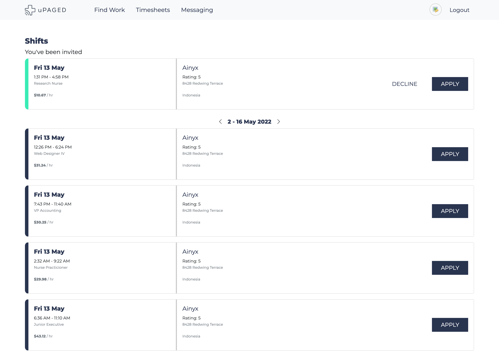

### Job Board Project

## Tech Stack
- Express with Typescript
- React Redux Toolkit Hooks
- Nedb (lighweight database)
- SCSS modules



### Running the Project

> Run the backend
```
cd backend/
npm install
npm run start:dev
```

Browser - http://localhost:8080
* You can find a request.http and see run the ff request in VScode

> Run the frontend
```
cd frontend/
npm install
npm start
```
Browser - http://localhost:3000
